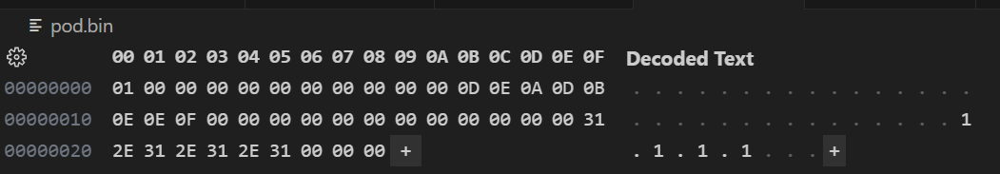

This simple example demonstrates how to serialize/deserialize a POD-type object to binary file with padding.

The POD class contains five members, two of which are reserved regions:

|name|width (bytes)|
|:--|:--:|
|m_flag|1|
|m_reserved_one|10|
|m_field_one|10|
|m_reserved_two|10|
|m_field_two|10|

As with all POD classes, you must initialize the object using aggregate initialization:

```
// Note: 
// 1. All members are zero-initialized so if you dont care 
//    the member can be initialised with empty braces
// 2. Ascii text can be initialized using a string literal

PodRecord podRecord { 
    true, 
    {}, // reserved
    {0xD,0xE,0xA,0xD, 0xB, 0xE, 0xE, 0xF},
    {}, // reserved
    "1.1.1.1"
};
```

The binary file contains the following data:



Serialization/deserialization uses streams and the overloaded insertion/extraction operators. Note that the member declaration order must be mirrored when reading/writing in the overloaded operators to prevent data corruption.

A helper template function returns a string representation of any member in either hex or ascii.