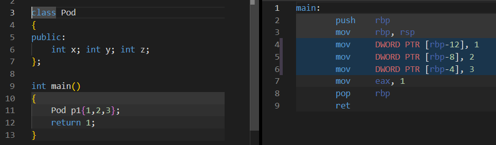
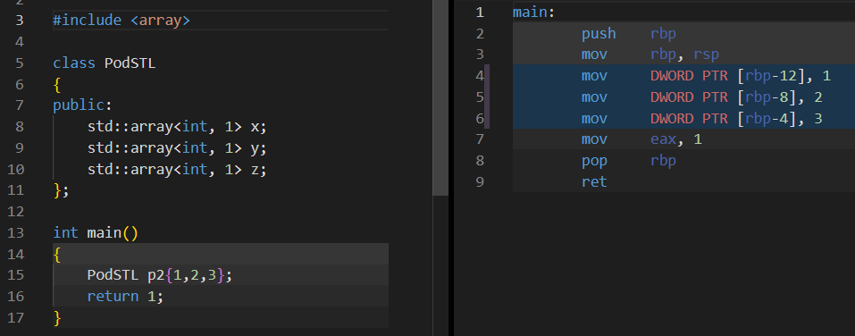
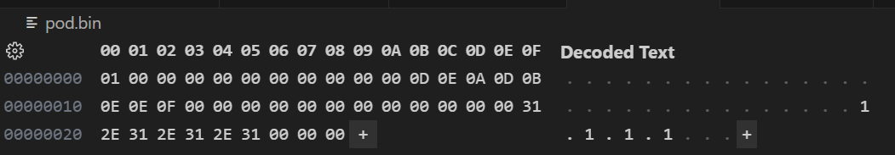

This simple example demonstrates how to serialize/deserialize a POD-type object to binary file with padding.

## PODRecord Class

The POD class contains five members, two of which are reserved regions:

|name|width (bytes)|
|:--|:--:|
|m_flag|1|
|m_reserved_one|10|
|m_field_one|10|
|m_reserved_two|10|
|m_field_two|10|

As with all POD classes, you must initialize the object using aggregate initialization:

```
// Note: 
// 1. All members are zero-initialized so if you dont care 
//    the member can be initialised with empty braces
// 2. Ascii text can be initialized using a string literal

PodRecord podRecord { 
    true, 
    {}, // reserved
    {0xD,0xE,0xA,0xD, 0xB, 0xE, 0xE, 0xF},
    {}, // reserved
    "1.1.1.1"
};
```

We can use STL `std::arrays` in POD classes because they resolve to the underlying POD types:




Using the std::array rather than C-style arrays allows easier handling of the array and avoids pointers.

## OORecord class

Using Non-POD classes provides the advantages of object orientated programming. Lets be honest: allowing inheritance and interfaces is going to make unit testing much easier. Of course there is no free lunch:

1. You have to write a special constructor to initilize the object. This is a minor inconvenience. On its own, this does not contribute to any binary output penalty.
2. Serializing a class that derives from a base class with a virtual destructor __will pollute your binary output__. The binary file ended up 15 bytes larger than the POD equivalent and contained bytes that we didn't want to serialize! The workaround is to manually write/read each member directly to the stream for serialize/deserialize operations. Note this is trivial for byte arrays, but care must still be taken to mirror the declaration order of the members or you will get data corruption. If only C++ had reflection we could iterate its members...

## Serialization

The serialized binary file contains the following data:



Some noteworthy points:

- The class member widths are honoured regardless of the input width; the serialization automtically zero-pads the remaining bytes. If the input width exceeds the class member width it will cause an error at compile-time.
- Because we are using POD classes, we can simply serialize/deserialize the entire obj without incurring any size penalty that would occur with regular classes.

Two examples of serialization/deserialization are shown. Both methods use streams:

1. Using overloaded insertion/extraction operators. 
   - The right hand operand is a user-defined object so the overloaded operator must be a non-member. Here we use `friend` to allow the operator to be placed within the class declaration.
2. Using member functions. 
   - Allows direct access to POD members from with the serialization/deserialization function.

I am torn between which method I prefer here: I like the stream syntax exposed to the user by the first method, but I prefer the encapsulation offered by the second method. In my opinion, having a non-member function as a custom object serializer/deserializer is an anti-pattern.


## Pretty Printing

A helper template function returns a string representation of any member in either hex or ascii.

```
// all outputs formatted as hex bytes
1
deadbeef00
312e312e312e31000

// last output formatted as ascii
1
deadbeef00
1.1.1.1
```
