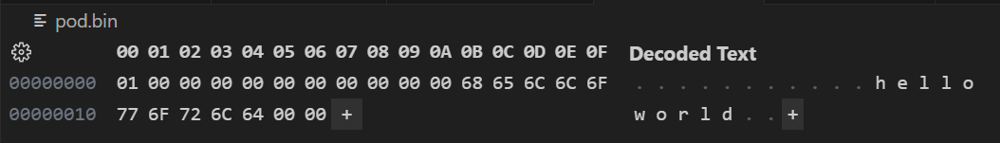

This example demonstrates how to serialize/deserialize a POD-type object to binary file with padding.

The POD class contains three members:

|name|width (bytes)|
|:--|:--:|
|m_flag|1|
|m_padding|10|
|m_field|12|

As with all POD classes, you must initialize the object using aggregate initialization:

```
// note the padding must be initialised with empty braces
PodRecord r{true, {}, "HelloWorld"};
```

Serialization/deserialization uses streams and the insertion/extraction operators.

The binary file contains the following data:

